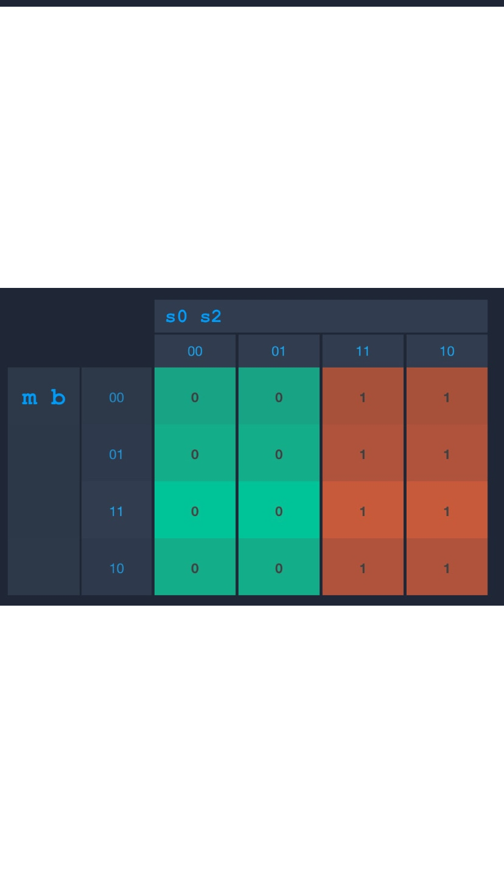

# Stopwatch with Finite State Machine

In this repo, i am showing the Finite State Machine of Stopwatch and implement the system with **C Programming Language**

### Description

In my Stopwatch system I use 4 states, Those 4 states are Exit, Ready, Run and Pause and I also use 2 Input devices which are Button 1 and Button 2.
The Exit state inidicates where the stopwatch is currently off. The Ready state is when the Stopwatch is already on and ready to count. Run state is when the Stopwatch is running, and lastly the pause stop is where the stopwatch is being paused.

### State Transitions

The initial state is Exit, then when you pressed button 1 or button 2 or pressed button 1 and 2 at the same time, it will go to Ready state which it will turn on the stopwatch. When on state Ready, to turn off the stopwatch you can press button 2 or button 3, it will go back to state Exit and when we pressed button 1 it will start the stopwatch and goes to Run state. On state Run, if you pressed button 1 or button 1 and 2 at the same time, it will keep running, but if you pressed button 2 it will pause the stopwatch and goes into State Pause and pressed button 2 again to unpause the stopwatch. When the stopwatch is paused, to turn off the stopwatch pressed either button 1 or button 2 it will go back to the initial state and to restart the stopwatch pressed button 1 and 2 at the same time it will go back to Ready state

From the State above I ended up with this table

And then I got these 4 K-Map

- ###### Next State (S0) K-Map

- ###### Next State (S1) K-Map

 

- ###### Output (O0) K-Map

- ###### Output (O1) K-Map

Finally from those K-Map i got these equations:
- $S0 = s0 s1' + s0 m' + s0' s1 m b'$
- $S1 = s1 m' b' + s1' m' b + s0' s1' m + s0 s1 m b$
- $O0 = s0$
- $O1 = s1$
