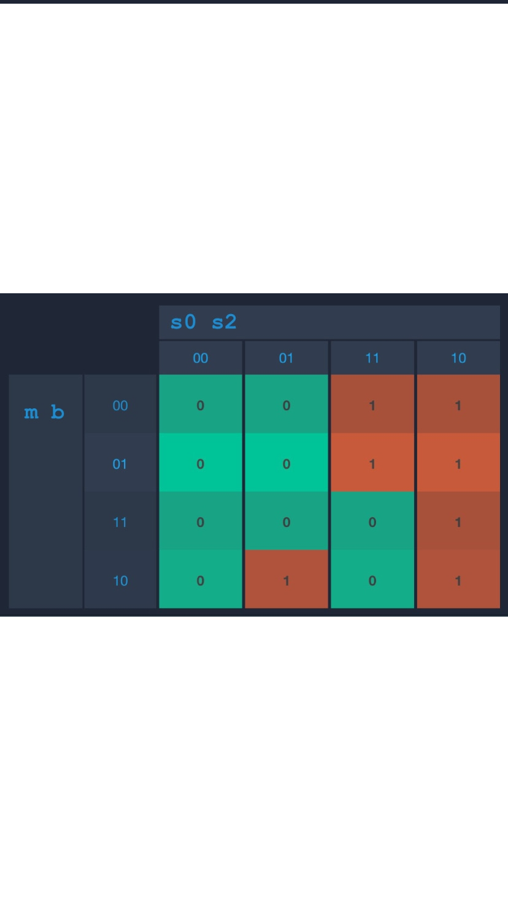
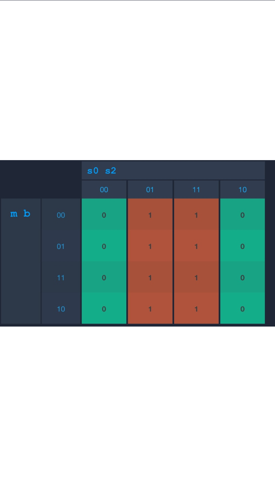

# Stopwatch with Finite State Machine

In this repo, i am showing the Finite State Machine of Stopwatch and implement the system with **C Programming Language**

### Description

In my Stopwatch system I use 3 states, Those 3 states are Exit, Ready,and Run/Pause and I also use 2 Input devices which are Button 1 and Button 2.
The Exit state inidicates where the stopwatch is currently off. The Ready state is when the Stopwatch is already on and ready to count. Run state is when the Stopwatch is running, and lastly the pause stop is where the stopwatch is being paused.

### State Transitions

The initial state is Exit, then when you pressed button 1 or button 2 or pressed button 1 and 2 at the same time, it will go to Ready state which it will turn on the stopwatch. When on state Ready, to turn off the stopwatch you can press button 2 or press button 1 and 2 at the same time, it will go back to state Exit and when we pressed button 1 it will start the stopwatch and goes to Run state. On the next state, there you can run/pause the stop watch, if you pressed 1 it will go back to ready state. If you pressed button 2 it will go back to initial state or exit and if you pressed button 1 and 2 at the same time it will run back the stopwatch

From the State above I ended up with this table

And then I got these 4 K-Map

- ###### Next State (S0) K-Map

- ###### Next State (S1) K-Map

 

- ###### Output (O0) K-Map

- ###### Output (O1) K-Map

Finally from those K-Map i got these equations:
- $S0 = s0' s1 m b' + s0 s1' m' b' + s0 s1' m b$
- $S1 = s1'm b' + s0' s1' b + s0' s1 m' b'$
- $O0 = s0$
- $O1 = s1$

## How to run
To run, we first download the file or clone the repo using "git clone <link>". Then after the downloaded the file or cloned the file, open the file and then write "make" on terminal. after write make you can use the input 0/1/2/3 to change the state

## The screenshots when running the program

